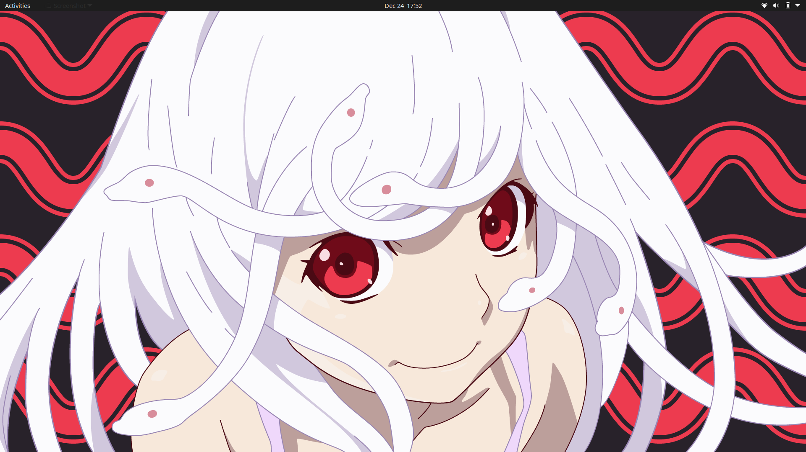

# dotfiles

[**Terminal**](https://sw.kovidgoyal.net/kitty/) • [**Shell**](https://fishshell.com/) • [**Editor**](https://neovim.io/) • [**Prompt**](https://github.com/rafaelrinaldi/pure) • [**DE**](https://www.gnome.org/) • [**Shell Theme**](https://github.com/ubuntu/yaru)

_— I had enough ricing, thanks._
